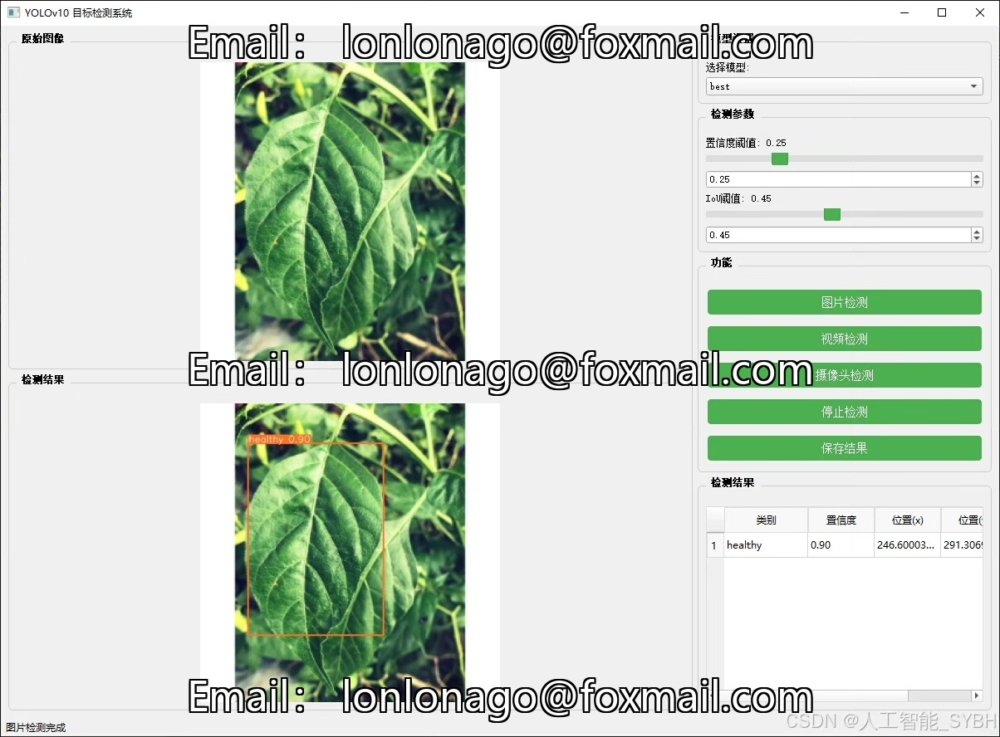
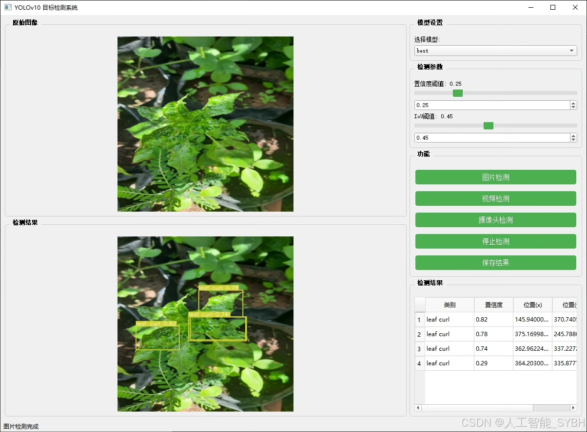
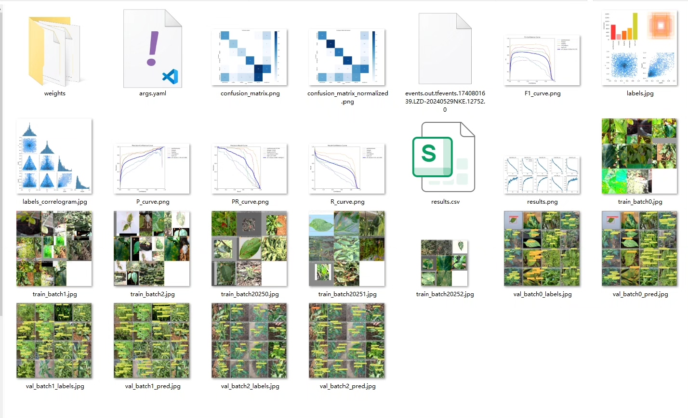
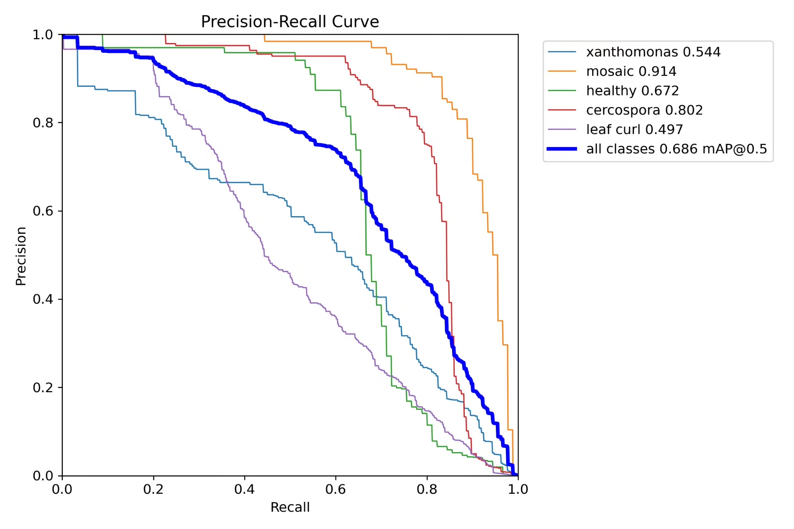
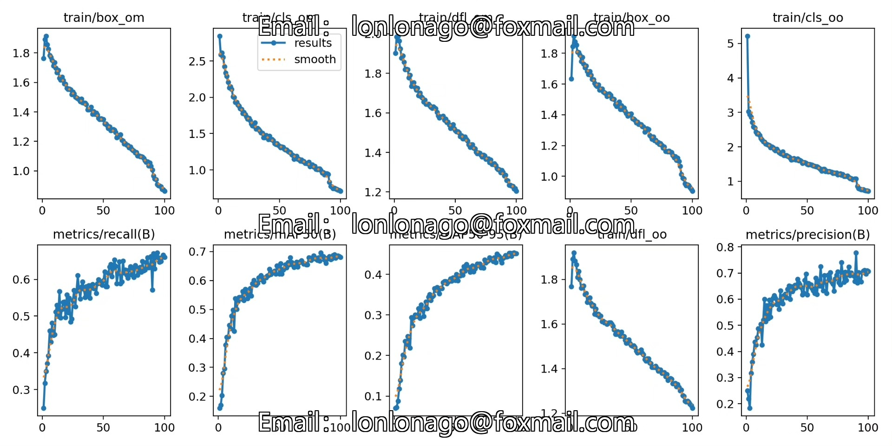
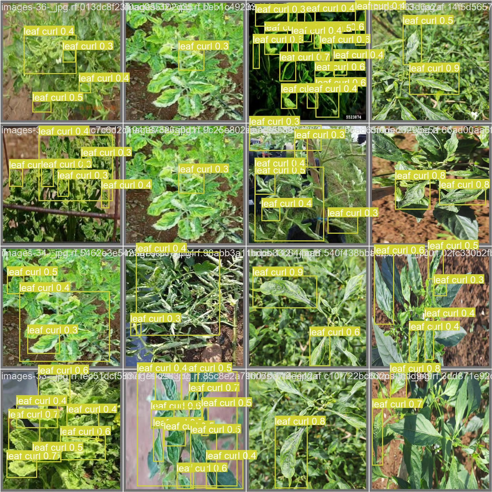
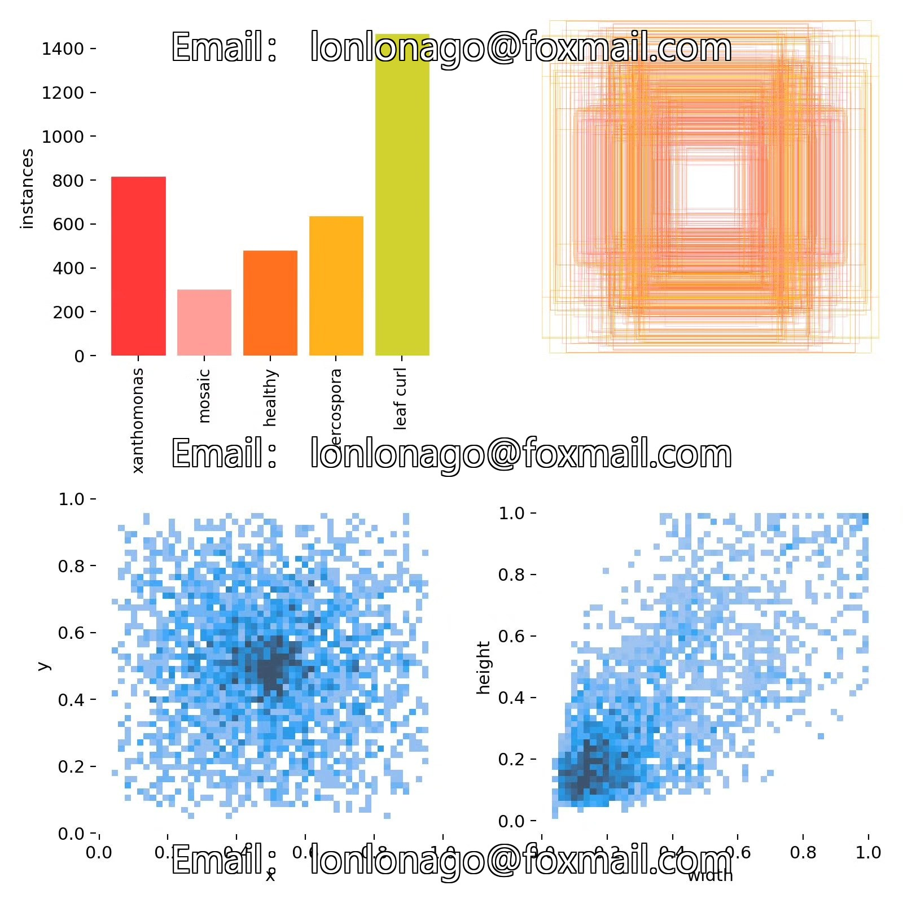
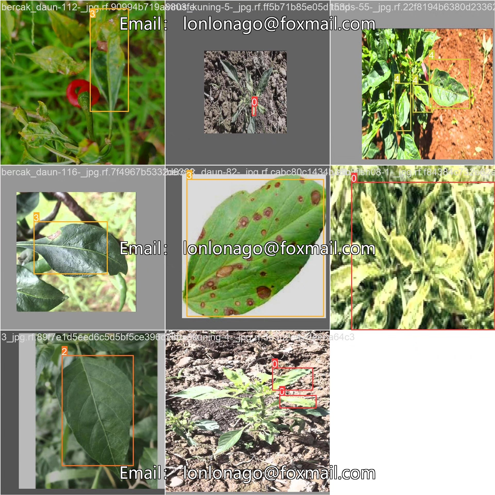

# Based on deep learning YOLOv10 for the detection of pepper leaf diseases

## Body

This project is based on the YOLOv10 object detection algorithm, developing an intelligent detection system for chili leaf diseases. The system can automatically identify and classify five common chili leaf states, including healthy leaves and four types of diseases (yellow stunting, mosaic, stem rot, and curling). Through deep learning technology, the model has completed training and optimization on 1796 training images and 462 validation images, achieving efficient and accurate disease detection, providing an intelligent solution for agricultural disease prevention and control.

The company's products have obtained the official commercial license certification from YOLO.

We provide after-sales service.

After payment, we will provide a WeChat account to answer questions anytime.

Environmental configuration: We will provide a tutorial on environmental configuration, and WeChat will provide answers.

Remote installation service: If you need remote configuration, an additional fee of 69 is required, with all fees refunded if the configuration fails (only refund installation fees for older computers).

Retraining dataset: After configuring the environment, you can train on your own computer. If you need us to retrain, just pay 69 plus computing power fees (2.5 yuan/hour).

Full after-sales service

## Images

## Payment

Here is a pay link on Stripe ( https://buy.stripe.com/3cs8yP7sY87d0vu9AB ). Please contact me lonlonago@foxmail.com after funding $89, and I will send you a complete data files , thank you!

